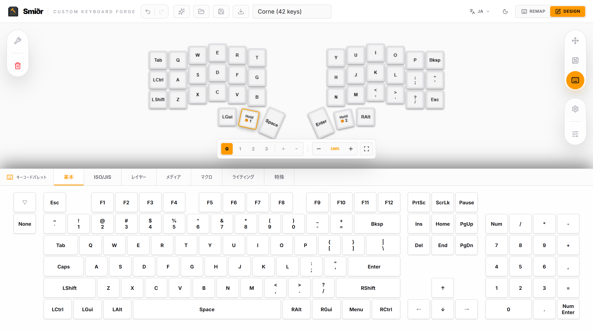
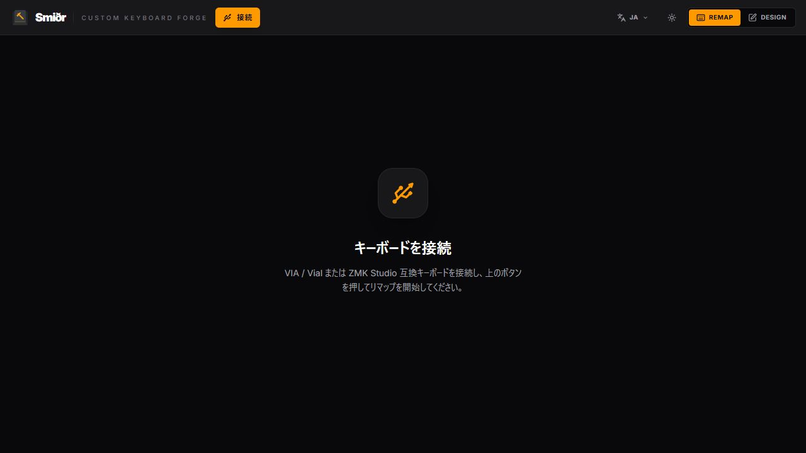

# Smiðr を作っています: ブラウザで自作キーボードを設計する小さな鍛冶場

自作キーボードを触っていると、キー配列、マトリックス、ファームウェア、リマップまわりの作業が地味にあちこちへ散らばります。

KLE でレイアウトを描いて、別の場所で配線やマトリックスを考えて、さらに VIA / Vial / ZMK まわりの設定を見に行って……という感じで、作業そのものは楽しいのに、道具を行ったり来たりする時間がけっこうあります。

しかも、キーボードは作ったら終わりではありません。むしろそこから「このキーは親指に置いたほうがいいかも」「このレイヤー、実際に使うと遠いな」「記号の置き場がまだしっくりこない」みたいな試行錯誤が始まります。

そこで作っているのが **Smiðr** です。

読み方は「スミズル」っぽい感じで、意味としては鍛冶屋。名前の通り、カスタムキーボードをブラウザ上でこねるためのアプリです。

## 何ができるアプリ？

Smiðr は、カスタムキーボードの設計からファームウェア出力、実機接続後のリマップまでを、ブラウザ上でまとめて扱うためのアプリです。

キーボード名やMCU、ピン割り当てなどのハードウェア設定を決める。物理レイアウトを定義する。どのキーがマトリックスのどの行・列に対応するかを設定する。レイヤーを作ってキーマップを決める。そういった作業を、ひとつの流れとして扱えるようにしたいと思っています。

もうひとつの狙いは、ファームウェアごとの違いをなるべく意識しなくていいことです。QMK / VIA / Vial / ZMK では、それぞれ設定ファイルの形や考え方が少しずつ違います。Smiðr では、まず「このキーボードはどういう形で、どう配線されていて、どんなキーマップなのか」をアプリ上で組み立てて、そこから必要な形式へ出力する、という流れを目指しています。

## Smiðr のモードとエディタ

Smiðr には大きく **Design** と **Remap** の2つのモードがあります。

Design モードは、キーボードそのものを作るための場所です。ここには、物理レイアウトを触るレイアウトエディタ、配線や行列を考えるマトリックスエディタ、レイヤーやキー割り当てを扱うキーマップエディタ、そしてハードウェア設定まわりの画面があります。

レイアウトエディタでは、キーの位置、サイズ、回転をキャンバス上で編集します。普通の60%やJIS配列だけでなく、Corne のような分割キーボード、親指クラスタ、少し傾いたキー配置も扱えるようにしています。ここは「まず形を作る」場所です。

マトリックスエディタでは、そのキーたちがどの行・列に属するのか、どのピンに割り当てるのかを整理します。自作キーボードでは、見た目の並びと電気的な行列がそのまま一致しないことも多いので、物理レイアウトとマトリックスを同じアプリの中で見られるようにしたいです。

キーマップエディタでは、各キーに何を割り当てるか、レイヤーをどう組むかを編集します。ここは作っている最中だけでなく、完成後にも何度も触る場所です。最初に考えたキーマップが一発で決まることはあまりないので、実際に使いながら「ここは戻したい」「このキーは別レイヤーに逃がしたい」を試せるようにしていきます。

こうして定義したレイアウト、マトリックス、ハードウェア設定、キーマップは、最終的にファームウェア側で使える形へ出力します。KLE 互換のレイアウトだけでなく、QMK / VIA / Vial / ZMK まわりへつなげるための出口まで、同じ流れの中に置きたいです。

Remap モードは、実機とつないでキーマップを調整するための場所です。VIA / Vial / ZMK Studio 互換のキーボードと接続し、ブラウザ上からリマップできる体験を目指しています。設計時のキーマップと、実際に使いながら育っていくキーマップをなるべく分断しないのが狙いです。

## 目指していること

やりたいことはシンプルで、**自作キーボードの設計と調整を、できるだけひとつの画面で気持ちよく完結させる**ことです。

キーの配置を少し動かしたい。親指クラスタの角度を変えたい。KLE から持ってきたレイアウトをもう少し調整したい。マトリックス情報も一緒に見たい。最終的には VIA / Vial / ZMK Studio 互換のキーボードとつないで、リマップまで触れるようにしたい。

そして、作ったあとにキーマップが決まるまでの時間も同じくらい大事です。レイヤーを組んで、数日使って、違和感が出たら直す。そういう「作っている途中」と「使いながら育てている途中」の細かい往復を、なるべく軽くしたいと思っています。

## 画面とUXのこだわり

デザインモードでは、キャンバス上にキーを並べて編集します。

左側に追加やインポート系のツール、右側に表示・編集系のツール、下側に選択中キーのプロパティという構成です。暗めのUIにしているのは、長時間レイアウトを眺めても疲れにくくしたいのと、キー形状が見やすいからです。もちろん好みや作業環境に合わせて、ライトモードにも切り替えられます。

操作感としては、レイアウトを見ながらその場で触れることを大事にしています。キーを選ぶ、動かす、回転させる、プロパティを調整する、といった作業をなるべくキャンバスから離れずにできるようにしたいです。自作キーボードの設計は細かい調整の連続なので、ちょっと直すたびに画面を行ったり来たりしなくて済むことを重視しています。

Undo / Redo や複数選択、グリッドに沿った調整も、安心して試せるための機能です。「この親指キー、もう少し寝かせたほうがいいかも」「この列だけ少しずらしたい」みたいな小さな実験を、怖がらずに繰り返せるようにしたいと思っています。

プリセットは今のところ、ANSI / ISO / JIS 系の一般的な配列に加えて、Corne などの分割キーボードも用意しています。

リマップ側は、VIA / Vial または ZMK Studio 互換キーボードとの接続を想定しています。ここはまだ育てているところですが、最終的には「設計したもの」と「実機で触るもの」の距離を縮めたいです。

自作キーボードのキーマップは、頭の中だけではなかなか決まりません。実際に文章を書いたり、コードを書いたり、ショートカットを叩いたりして、ようやく「ここは違うな」が見えてきます。そのたびに設定を書き換える作業が重いと、改善の勢いも落ちてしまうので、Smiðr ではその試行錯誤まで軽く扱えるようにしていきたいです。

## これから

まだ開発中ですが、次のあたりを育てていく予定です。

- KLE インポート / エクスポートの使い勝手改善
- マトリックスと物理レイアウトの対応編集
- VIA / Vial / ZMK Studio まわりの連携
- 実機接続時のリマップ体験
- レイヤーやキーマップを試しながら詰めるための編集体験
- プリセットやテンプレートの追加

自作キーボードは、設計している時間も含めて趣味だと思っています。

Smiðr は、その設計中の「もう少しここを詰めたい」「この角度いいかも」「配線どうしようかな」と、使い始めてからの「このキー位置、やっぱり違うな」「このレイヤーをもう一段整理したい」を、ブラウザ上で気軽に触れる場所にしていきたいです。

まだ鍛冶場の火を入れたばかりですが、少しずつ叩いて形にしていきます。

## 人柱募集

まだ開発中なので、いろいろ粗いところもあると思います。特に、手元のキーボードで読み込めるか、レイアウトやキーマップが自然に扱えるか、ファームウェアまわりの出力が期待に近いかは、できるだけ多くの実例で試したいです。

もし興味があれば、ぜひ手元のキーボードで触ってみてください。動いた、動かなかった、ここが分かりにくい、この画面がほしい、こういうキーボードだと困る、みたいな話をもらえるとかなり助かります。

自作キーボードは人によって構成も好みもかなり違うので、いろんなケースを踏ませてもらえるとうれしいです。

## リンク

- デモ: https://hringdrifi.github.io/smidr/
- GitHub: https://github.com/hringdrifi/smidr

## 画像メモ

note に投稿するときは、以下の画像をアップロードして本文中に差し込む想定です。

- `docs/note-assets/smidr-design-corne.png`: メイン画像向け。Corne プリセットを読み込んだデザイン画面。
- `docs/note-assets/smidr-remap-connect.png`: リマップ・接続機能の紹介向け。
- `docs/note-assets/smidr-editor-layout.png`: レイアウトエディタ紹介向け。
- `docs/note-assets/smidr-editor-matrix.png`: マトリックスエディタ紹介向け。
- `docs/note-assets/smidr-editor-keymap.png`: キーマップエディタ紹介向け。
- `docs/note-assets/smidr-editor-hardware.png`: ハードウェア設定・ファームウェア出力の説明向け。
- `docs/note-assets/smidr-editor-layout-options.png`: レイアウトオプション紹介向け。
- `docs/note-assets/smidr-remap-before-connect.png`: Remap モードの接続待ち画面。
- `docs/note-assets/smidr-remap-vial-connected.png`: Vial キーボード接続後の Remap モード画面。
